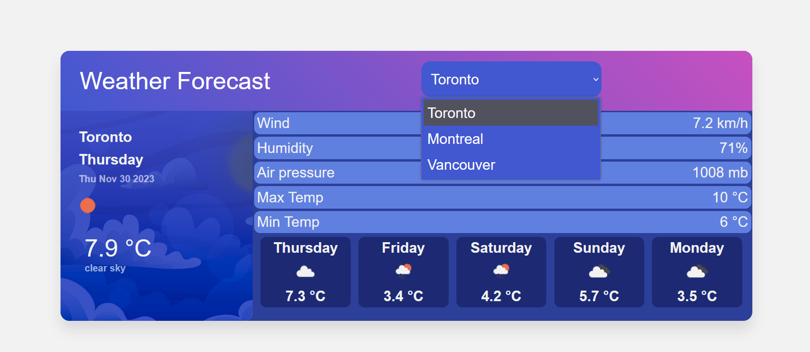
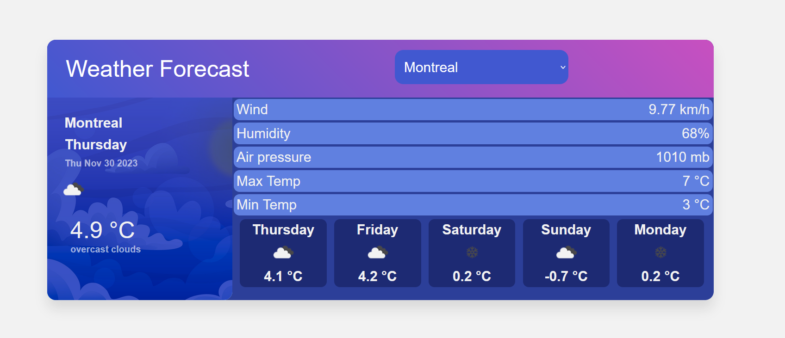
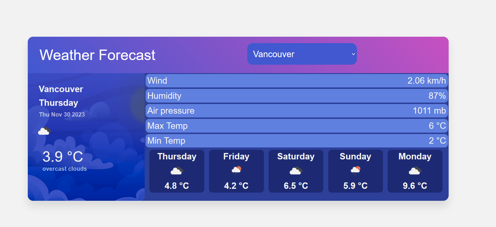
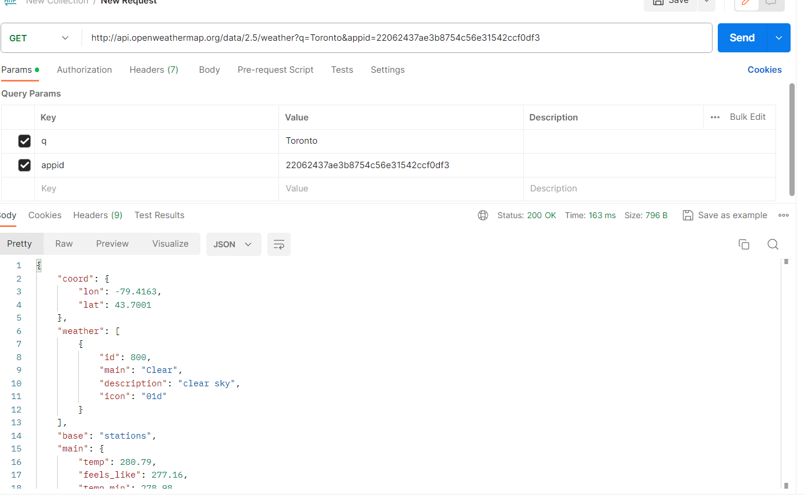
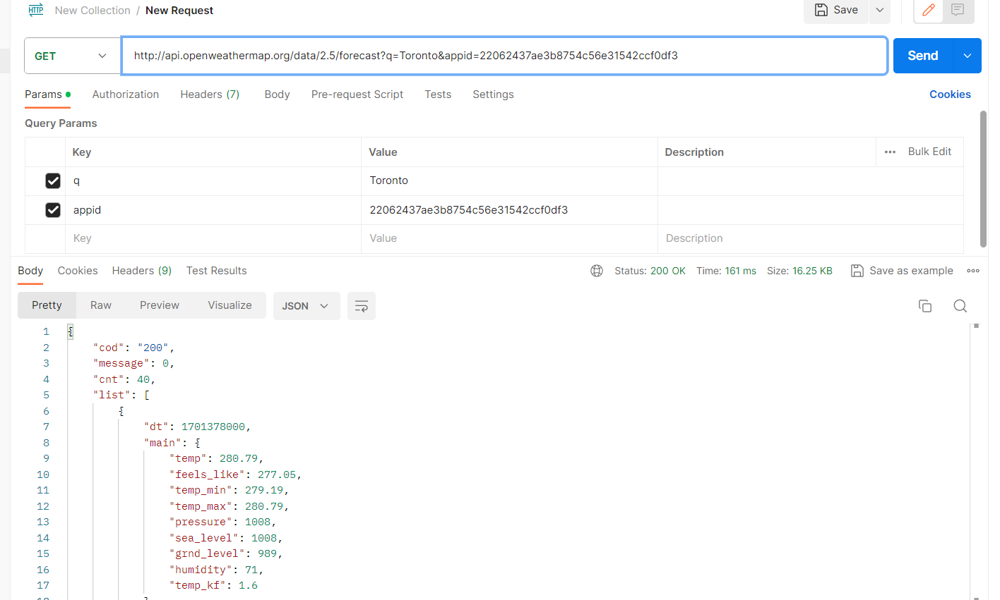

## Home Screen Displays Toronto Temperature with Date and Descriptions and showing the Average Temperature for the next 5 Days
### The Icons used for the weather come from http://openweathermap.org/img/wn

## I added a Select Bar to apply Dynamic Changes to the Data

## The values for the description changes as well as for the 5 next days when changing city
### Montreal Screen

### Vancouver Screen

### The Data Comes From two calls, one for the data of the actual day, the other one for a list of data of week

